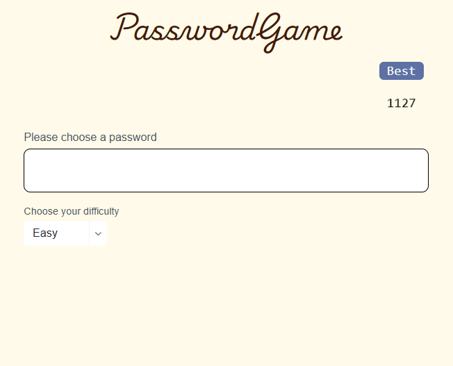
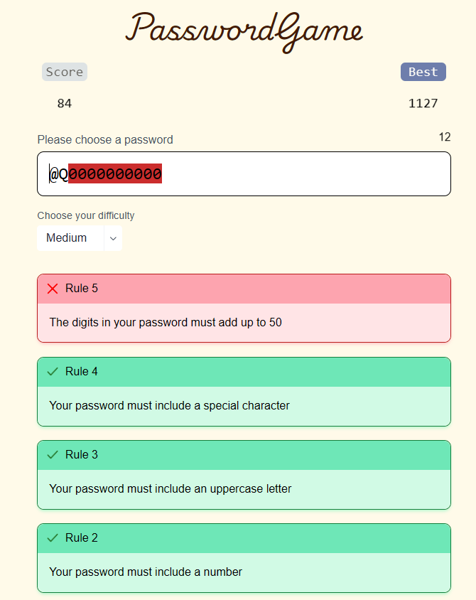
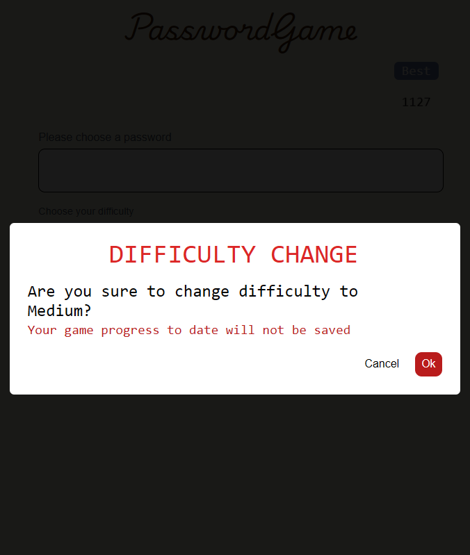
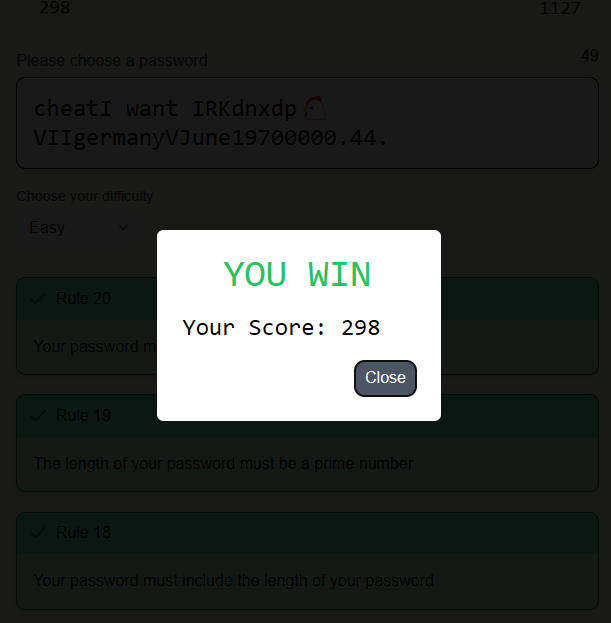
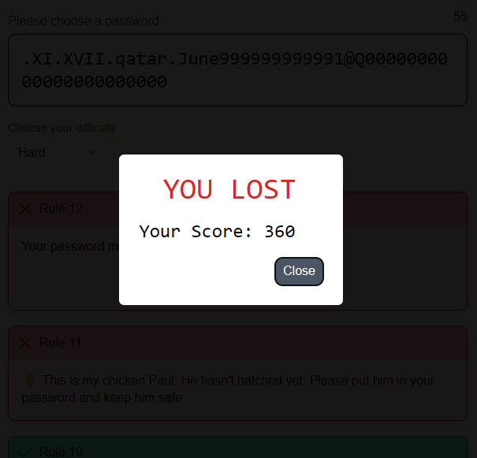

# Password Game
Password game adalah permainan yang menantang penggunanya untuk membentuk sebuah password sesuai dengan syarat-syarat yang diberikan. Password yang kuat adalah password yang memiliki pola dan keragaman karakter yang banyak. Game ini memiliki 20 rule yang harus dipenuhi pengguna untuk memenangkan permainan.

### Technologies Used
- React
- Express
- Node.JS
- JavaScript
- Tailwind CSS

### Program Structure
```
.
├── public
├── src
│   ├── assets                  # Icon
│   ├── components              # UI components
│   ├── model                   # Game class and data
│   ├── util
└── ...
```
### Regex and KMP Algorithm
Regex atau Regular Expression digunakan untuk melakukan pencocok string pada teks password. Regex memiliki peran penting pada proyek ini karena kemampuannya dalam mencocokkan string pada kasus pencarian digit, bilangan romawi, dan pencocokan teks secara case-insensitive. 
Sementara Algoritma KMP atau Knutt-Morris-Pratt digunakan untuk melakukan pencarian string biasa. Contohnya dalam pencarian pattern ```cheat``` pada password. KMP digunakan karena lebih efisien dalam pencarian kata dalam password karena keragaman karakter yang sangat banyak. Oleh karena itu, pencarian menggunakan algoritma ini cukup cocok untuk kasus permainan Password Game.

### How to Run
Program sendiri sudah di deploy baik [Back-End](https://bepassword-game.vercel.app) maupun [Front-End](https://sotul-password-game.vercel.app).
Repositori untuk Back-End dapat dilihat melalui link [berikut](https://github.com/sotul04/password-game-BE).

Jika Anda memilih untuk menjalankan program ini secara lokal, Anda dapat mengikuti langkah berikut ini.

> Pastikan Anda sudah menginstall Node.JS dan npm.

Setelah melakukan clone, atau mengunduh kode dan mengekstraksi file terkompres dari program ini, install seluruh dependency yang dibutuhkan dengan command ini
```
npm install
```
Selanjutnya, jalankan program dengan command ini
```
npm start
```
### Tangkapan Layar
<div align=center>

<br>
  <b>Fig 1.</b> Tampilan awal permainan
<br>
</div>
Pada awal permainan, beginilah tampilan awal permainan. Karena sebelumnya sudah pernah dimainkan, maka highest score sudah terlihat.
<br>
<br>

<div align=center>

<br>
  <b>Fig 2.</b> Tampilan ditengah permainan
<br>
</div>
Saat pengguna mulai memasukkan password setiap 200 ms password akan dievaluasi untuk memunculkan rule yang telah dipenuhi satu per satu. Highlight dilakukan pada beberapa kasus di seperti rule 5 dan rule 9.
<br>
<br>

<div align=center>

<br>
  <b>Fig 3.</b> Perubahan kesulitan permainan
<br>
</div>

<br>

<div align=center>

<br>
  <b>Fig 4.</b> Tampilan menang
<br>
</div>

<br>
<div align=center>

<br>
  <b>Fig 5.</b> Tampilan kalah
<br>
</div>
Saat menang atau kalah skor akan disimpan sebagai skor tertinggi jika skor tersebut adalah skor yang tertinggi hingga saat ini. Skor ini disimpan pada browser perangkat masing-masing.
<br>
<br>

### Back-End
Back-End yang dibuat menggunakan Express.JS dan telah dideploy dengan [tautan ini](https://bepassword-game.vercel.app).

### Referensi
- Algoritma KMP dipelajari dari [modul ini](https://informatika.stei.itb.ac.id/~rinaldi.munir/Stmik/2020-2021/Pencocokan-string-2021.pdf). 
- Regex dipelajari dari [modul ini](https://informatika.stei.itb.ac.id/~rinaldi.munir/Stmik/2022-2023/String-Matching-dengan-Regex-2019.pdf).
